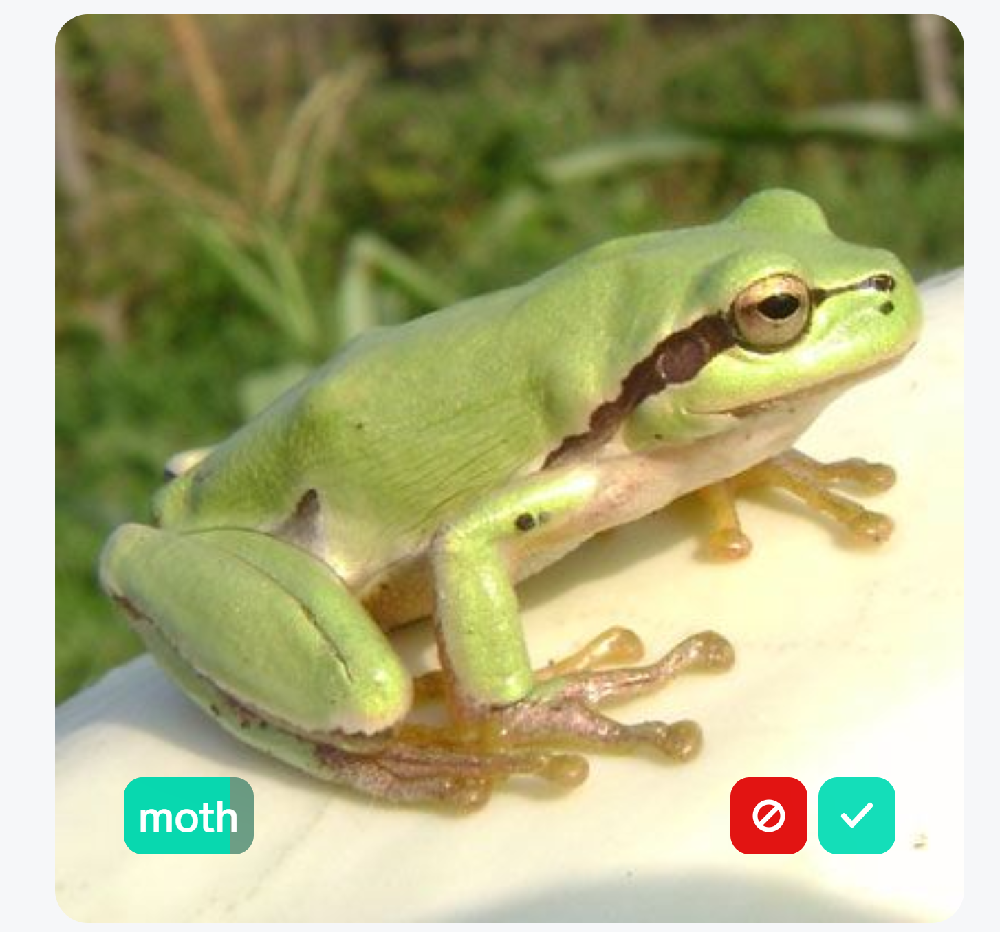
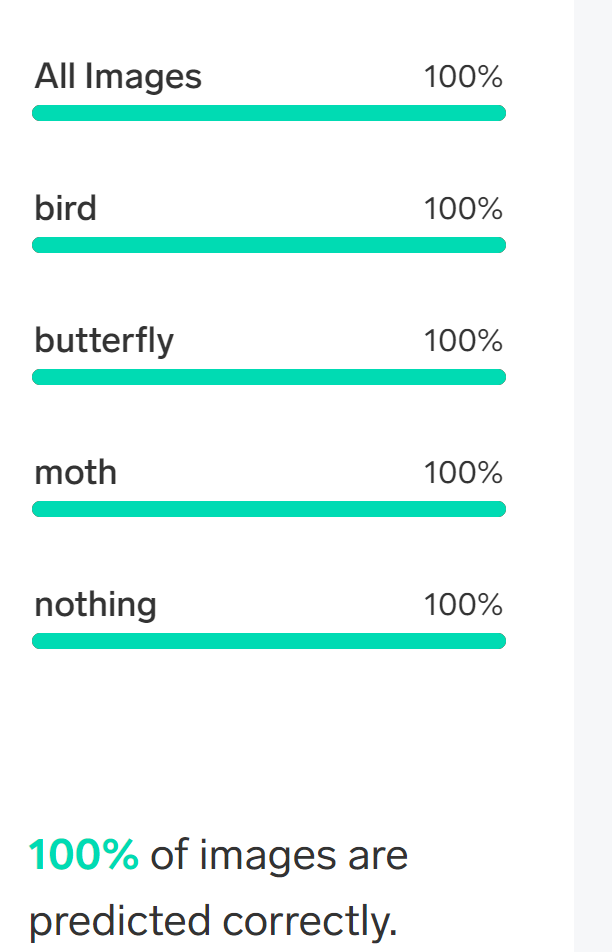

# Goal 2: Test and refine

Your team should be proud! You've created your model!

But how do you know if it's working correctly? You have to test it! Fortunately, testing in Lobe will also improve your model as you test.

## Testing the model

The way you test and improve your model is by *using* it - that's where the "learning" in machine learning comes from. With Lobe, this is a simple task and let's you see how and why the model is classifying some of your images better than others.

Here are some things to keep in mind as you refine your model:

- Understand your problem - start simple, expand over time. Break your scenario down into smaller experiments to prototype and then expand over time.

- Lobe only learns from the examples you import. Try to collect examples that cover the different types of images your model will see and make predictions on in the future.

- More images always help - new and unique images are better. The more unique and different the images are, the better your model will learn to generalize.

- If you can’t classify the label from looking at an image, it will also be difficult for Lobe. Make the image content as large and relevant to your label as possible.

> ⛔️ Biases in data sets
>
> Data is collected by humans and humans have biases.
>
> Bias in machine learning models can be difficult to identify because a model just replicates and reinforces pre-existing biases in the data set.
>
> Representation in your model often should not replicate representation in real life. For accurate classification, you need to have equal representation for each of your labels.

## Application notes

- Testing your model happens in the `Use` tab. Like the previous steps, you can import images or use your device camera.
- Tune your model by accepting or rejecting the label that the model suggests for the image(s)
- When you have filled the label bar completely, your model has been fine-tuned to achieve 100% classification accuracy

    
    
    <small>That's not a moth! Reject!</small>

## Success criteria

Your team will make the necessary updates to the model via testing. Your team will have achieved this goal when the following success criteria are met:

- Your test images equal or outnumber the training images
- The model accurately classifies an image 98% of the time or higher

## Resources

Your team might find these resources helpful:

- [Lobe - Improving the model](https://www.lobe.ai/docs/improving/improving)
- [Lobe - Working with your results](https://www.lobe.ai/docs/results/results)

## Final result

After improving your model, you should see something like the following for your labels:

## Next challenge

Once your team has improved the model, you can [export it](./3-export.md)!
