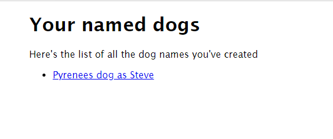

# Goal 3: Create and configure a cloud-based database

Congratulations on enabling authentication for the application! Authentication commonly a key component to any web project.

Similarly, almost every web application will need some form of a database. If you remember the primary workflow again, the goal is to have users create names for the dogs, which will then be saved to a database. The time has come for your team to create and configure the database.

## The Azure Service

[Azure Cosmos DB](https://docs.microsoft.com/azure/cosmos-db/introduction?WT.mc_id=academic-28005-chrhar) is a document or [NoSQL](https://en.wikipedia.org/wiki/NoSQL) database service. Cosmos DB provides different APIs you can use to access it, including an [API for MongoDB](https://docs.microsoft.com/azure/cosmos-db/introduction?WT.mc_id=academic-28005-chrhar), which allows the Node.js MongoDB client to interact with it. Most recently, [Cosmos DB serverless](https://docs.microsoft.com/azure/cosmos-db/serverless?WT.mc_id=academic-28005-chrhar) was released, which similar to other serverless products charges are based on usage. Your team will create a Cosmos DB account and configure the application to use your new Cosmos DB deployment.

## Application notes

Open */api/helpers.js*. This file contains a couple of functions to aid the development of the server-side portion of this project. The key function is `getMongoClient`.

```javascript
getMongoClient() {
    const { MongoClient } = require("mongodb");
    const uri = process.env.MONGO_CONNECTION_STRING;
    const client = new MongoClient(uri, {
        useNewUrlParser: true,
        useUnifiedTopology: true,
    });
    return client;
}
```

`getMongoClient` contains the code to connect to the database. Notice `process.env.MONGO_CONNECTION_STRING`, which is using [process.env](https://nodejs.org/dist/latest-v14.x/docs/api/process.html#process_process_env) to read an environment variable. After creating the database on Azure, your team will need to ensure the environment variable is set correctly on the static web app in Azure.

When creating your team's instance of Cosmos DB, use the Serverless option. This will allow you to pay for usage rather than a fix fee. For this sample application, the costs will be extremely cheap (under $1 US). Fortunately, since you will be using [Azure for Students](https://aka.ms/a4s), you have free credit!

## Success criteria

Your team will create the necessary resources and make the necessary updates in Azure to enable the application to access a Cosmos DB database. Your team will have achieved this goal when the following success criteria are met:

- A Cosmos DB Account has been created
- The static web app configuration has been updated in Azure
- In the website, you are able to perform the following tasks:
  - Login to the site
  - Name a dog
  - Navigate to the favorites page by selecting *review the list* to see the dogs you named

## Validation

Have a mentor check your site to ensure everything has been completed!

## Resources

Your team might find these resources helpful:

- [Create an Azure Cosmos DB account](https://docs.microsoft.com/azure/cosmos-db/create-cosmosdb-resources-portal#create-an-azure-cosmos-db-account?WT.mc_id=academic-28005-chrhar)
- [Get the MongoDB connection string by using the quick start](https://docs.microsoft.com/azure/cosmos-db/connect-mongodb-account#get-the-mongodb-connection-string-by-using-the-quick-start?WT.mc_id=academic-28005-chrhar)
- [Configure application settings for Azure Static Web Apps](https://docs.microsoft.com/azure/static-web-apps/application-settings?WT.mc_id=academic-28005-chrhar)
- [Troubleshooting deployment and runtime errors](https://docs.microsoft.com/azure/static-web-apps/troubleshooting?WT.mc_id=academic-28005-chrhar)

## Tips

- The application will automatically create a database and collection to store data; the only resource your team needs to [create is an Azure Cosmos DB account](https://docs.microsoft.com/azure/cosmos-db/create-cosmosdb-resources-portal#create-an-azure-cosmos-db-accoun?WT.mc_id=academic-28005-chrhart)

## Final result

After creating database and configuring the application, you should now be able to login, name a dog, and see the list of all dogs you've named.


