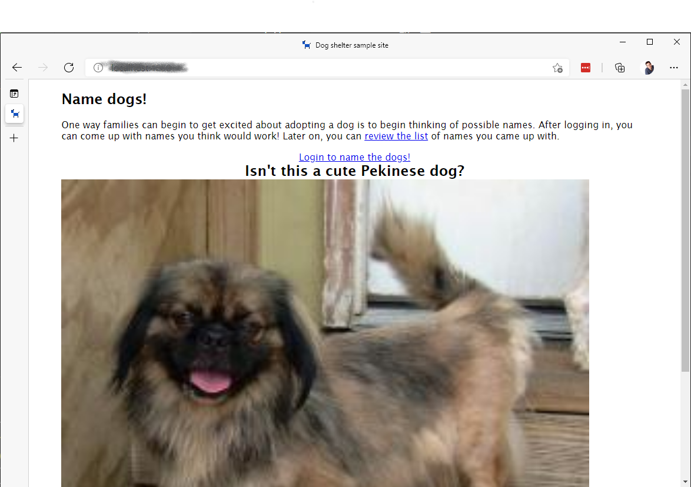

# Running the application locally

As highlighted, your team does not have to run the application locally to successfully complete the workshop. However, if you want to setup your system, you'll need to perform one local install, and make a note about 

## Install MongoDB

The workshop application uses MongoDB API. To perform local development, you will need MongoDB installed.

- [MongoDB Community Server](https://www.mongodb.com/try/download/community)
  - [Install MongoDB Community Server on Windows](https://docs.mongodb.com/manual/tutorial/install-mongodb-on-windows/)
  - [Install MongoDB Community Server on macOS with Brew](https://docs.mongodb.com/manual/tutorial/install-mongodb-on-os-x/)
  - [Install MongoDB Community Server on Linux](https://docs.mongodb.com/manual/tutorial/install-mongodb-on-ubuntu/)
    - Note: If you are using Windows Subsystem for Linux (WSL) with Ubuntu, you can install MongoDB using the following commands

      ```bash
      sudo apt-get install mongodb
      service mongodb start # Start mongodb
      ```

> **IMPORTANT**: Make sure MongoDB is started after you install the service.

## Starting the application

After you have downloaded the source code locally, you are all set to run it! You'll rename one settings file, and then start the server!

1. Inside Visual Studio Code, locate the file named *starter-settings.json*. Rename the file to *local.settings.json*.

    *local.settings.json* contains environmental variables used by Azure Functions. For the starter project, it contains the connection string to the database, MongoDB running locally on your machine.

1. Inside Visual Studio Code, open a new terminal by selecting *Terminal* > *New Terminal*.
1. Run the following commands to change to install the packages for both the api and client, and start the development server:

    ```bash
    cd api
    npm install
    cd ..
    npm install
    npm run dev
    ```

    After the scripts have run, your dev server will be started

1. Open the website by navigating to [http://localhost:4280](http://localhost:4280)

    

> A note about authentication: The project uses the [Azure Static Web Apps CLI](https://github.com/Azure/static-web-apps-cli#azure-static-web-apps-cli-preview) to host the application. When you click "login", you will be presented with a page where you can provide your own username and ID. This allows you to simulate authentication without having to actually login to GitHub or another provider.
