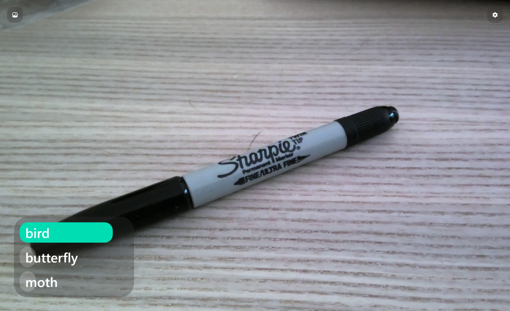

# Goal 4: Running the application locally

Congratulations on exporting your model! In this step, you will run the web application locally. You do not need to modify any of the application code to get this working.

## Install the application dependencies

The web application uses Node.js Yarn. To perform local development, you will need Node.js and Yarn installed.

- [Node.js](https://nodejs.org/)
    - [Install Node.js on Windows](https://docs.microsoft.com/windows/dev-environment/javascript/nodejs-on-windows)
    - [Install Node.js on Linux or MacOS](https://github.com/nvm-sh/nvm#installing-and-updating)
- [Yarn](https://yarnpkg.com/getting-started/install#per-project-install)
  

Once you have all of the packages installed and the application built:

1. Open a terminal and navigate to the [sample web application] folder 
1. Run the following command to install the project dependencies
    ```bash
    yarn install
    ```

## Starting the application

After you have installed all of the project dependencies, you are all set to run it!

1. Open a terminal and navigate to the [sample web application] folder
1. Run the following commands to start the development server:
    ```bash
    yarn start
    ```
1. Open the website by navigating to [http://localhost:3000](http://localhost:3000).
    <figure>
    {style="width:100%"}
        <figcaption>That's a sharpie, not a bird! The model will always attempt to label an image with the best fitting label it knows - even if it doesn't make sense.</figcaption>
    </figure>

    !!! Caution "Browser permissions"
        Your browser may ask you accept opening the insecure site "localhost:3000" or ask if the page can access your device cameras. Please refer to your browser documentation on how to do this.

2. It's ready to use! You can either upload an image from your device or use your device camera.

## Resources

Your team might find these resources helpful:

- [Lobe - Running the sample web app](../apps/web-bootstrap/README.md)

<!-- References -->
[sample web application]: ../apps/web-bootstrap

